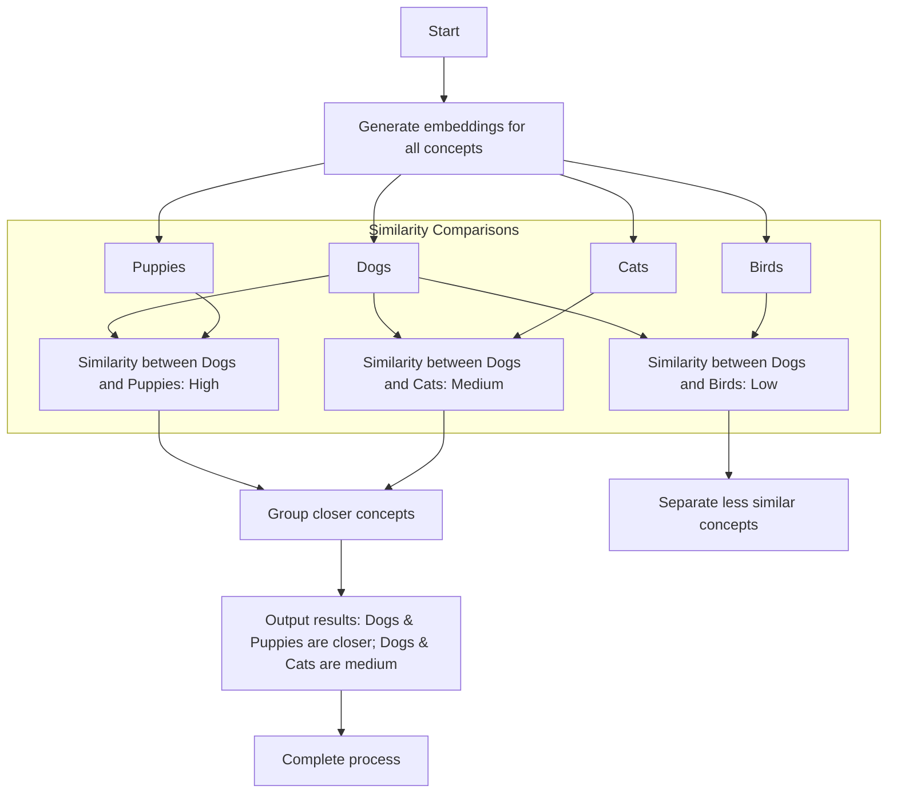

# opensearch-langchain

The idea of this repo is to share an approach on how to query your knowledge base by simply using natural language, leveraging an Aiven OpenSearch service, as vector database, and LangChain framework.

## What is a Vector Databse?

A vector database is like a library that stores numbers called "vectors," which are special codes that describe things like pictures, words, or sounds. Instead of just looking up exact matches, this library helps find things that are similar. For example, if you search for a picture of a cat, it can show you pictures of other cats or animals that look alike, even if they’re not the same exact picture.

## What is Embedding?

An embedding is a way to turn things like words, pictures, or sounds into a set of numbers that evaluated mathmatically. It’s like giving each word or picture a unique "code". For example, the words "dog" and "puppy" might have codes that are very close to each other because they mean similar things. This helps computers compare and find related ideas easily.



# OpenSearch + LangChain
Aiven for OpenSearch service is a managed vector database service that makes it easy to deploy, operate and scale OpenSearch clusters in the cloud: AWS, GCP, Oracle, Digtial Ocean...  

LangChain is a framework for developing applications powered by Large Language Models (LLMs).

To query your knowledge base using natural language, you'll need to injest the documents, then convert and store the vectors.

We can use the `langchain` libraries to do the work here. 
```
from langchain.schema import Document                   # The main LangChain library for chaining models together.
```

## Open-source Embedding (from hugging-face hub)

```
from langchain_huggingface import HuggingFaceEmbeddings # The Hugging Face embeddings for generating embeddings.
...
# Initialize Hugging Face embeddings
model_name = "sentence-transformers/all-mpnet-base-v2"
model_kwargs = {'device': 'cpu'}
encode_kwargs = {'normalize_embeddings': False}
hf = HuggingFaceEmbeddings(
    model_name=model_name,
    model_kwargs=model_kwargs,
    encode_kwargs=encode_kwargs
)
```

The model is used to embed either the full collection of text documents or the on-the-fly human natural language queries.

## Ingestion (`vectors.py`):
An example script to load and ingest your raw text documents into the vector database.

```
# Raw data as documents
docs: List[Document] = [
    Document(page_content="Hello World!", metadata={"sentiment": "positive", "source": "Every web tutorial"}),
    Document(page_content="If you want to live a happy life, tie it to a goal, not to people or things.", metadata={"author": "A. Einstein"}),
    Document(page_content="Not how long, but how well you have lived is the main thing.", metadata={"author": "Seneca"}),
]
```

It assumes a document is composed of free text (page content) and some metadata (json-like format) containing metadata information of the document itself such as the author, the creation date, etc.

In this example, only the page content is used to generate the vector embedding of the document, following the steps:

* Load data and structure them as LangChain Document objects;
* Embedding of the full document collection using a LLM and the LangChain tool;
* Ingestion to OpenSearch vector database;

```
# OpenSearch Client
docsearch = OpenSearchVectorSearch.from_documents(
    docs,
    embeddings,
    opensearch_url=args.opensearch_url,
    index_name="vector",
    engine="faiss",
    bulk_size=50 
)
```

## Test the Vector Database (`vectors.py`):
The retrieval function is to retrieve from the vector database the most relevant documents starting from a natural language user query.

Query the knowledge base using natural language. The top most similar documents to the user query will be retrieved.

```
# Test the vector db
query = "Hi World"
print(f"Vector Query: {query}")

retrieved_docs = docsearch.similarity_search(query)

# Print the most similar document
print(f"Results: {retrieved_docs[0].page_content}")
```

The script is using the same OpenSearch client connection to a specific index name and domain through LangChain tool, but for retrieval purposes, this could be simplified to:

```
# OpenSearch Client
docsearch = OpenSearchVectorSearch.from_documents(
    docs,
    embeddings,
    opensearch_url=args.opensearch_url,
    index_name="vector"
)
```

Note that the quality of the retrieved results will also depend on the embedding model (LLM) used.

 In the example above it was used an open-source LLM coming from Hugging-Face hub, but you could try to compare with other embedding models.

# Using this code sample...

```
.
├── README.md
├── provider.tf
├── python
│   ├── Dockerfile
│   ├── requirements.txt
│   └── vectors.py
├── resources.tf
└── variables.tf
```

The terraform provided here is configured to work with a docker (or podman) instance. 

You'll want to configure am Aiven API Token as an environemnt variable. 

Run `terraform init` to download the providers and stage the directory.

Then `terraform plan --var aiven_api_token=$AIVEN_API_TOKEN` should show 3 resources:

* Aiven Opensearch
* Docker Image
* Docker Container

 ```
Plan: 3 to add, 0 to change, 0 to destroy.
```

Finally, `terraform apply --var aiven_api_token=$AIVEN_API_TOKEN`

Using the Aiven provider, terraform will configure an OpenSearch instance. 

Once available, using the Docker provider, terraform will configure a python instance, install the libraries and run the script with the Opensearch service URI as an input variable. 

Finally, it should show run a local command to watch the log output from the container:
```
docker logs python-container
```

If it doesn't appear right away, you can watch the output:
`watch -n3 docker logs python-container`

If everything has deployed correctly, you should see output similar to the following:

```
Using OpenSearch URL: https://<user>:<pass>@<hostanme>.aivencloud.com:22418
Generate Embeddings...
Testing Query: Hi World
Results: Hello World!
```

In this instance, our query `Hi Word` most is most closely associated with our `Hello World!` docuemnt.